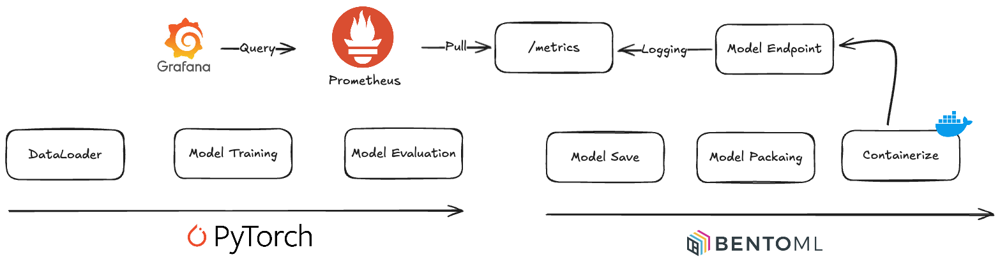
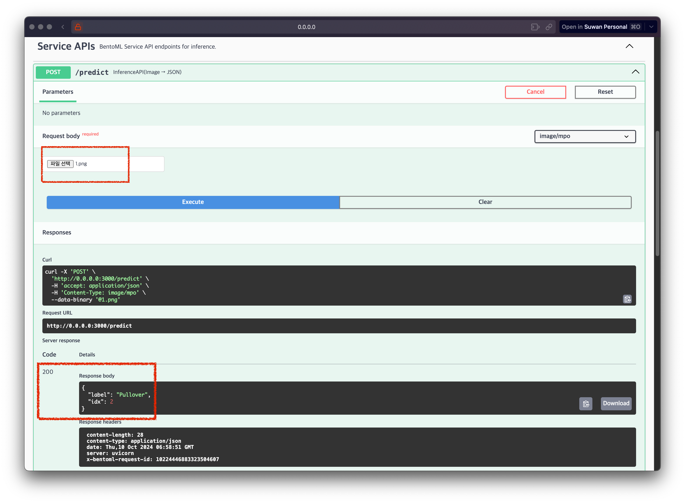
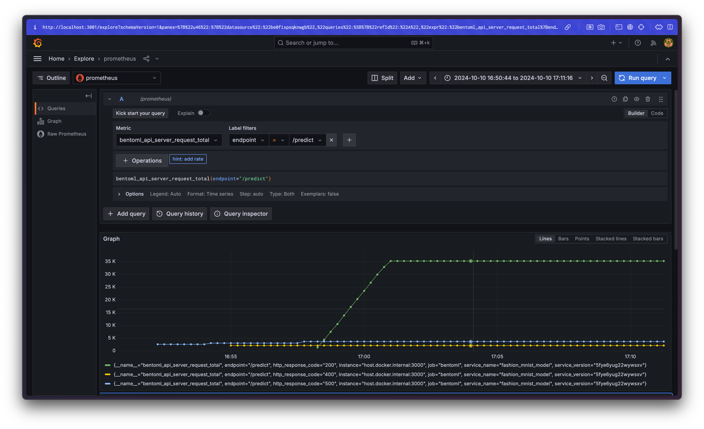

# BentoML로 패키징하여 배포하고 Prometheus로 모니터링하기

*블로그에서 필요한 코드들은 https://github.com/Ssuwani/bentoml_prometheus 에 정리해두었습니다.*

## 0. 들어가며

BentoML은 모델을 쉽게 패키징하고 배포할 수 있는 오픈소스 라이브러리입니다. 또한, 배포된 모델에 대한 온라인 모니터링을 지원합니다. 

이 글에서 수행할 과정을 간단히 그림으로 나타내면 아래와 같습니다.



1. PyTorch로 모델 학습하고 평가하기
2. BentoML로 모델 패키징하여 Containerize 한 뒤 배포하기
3. Prometheus로 모델 모니터링하기

## 1. PyTorch로 Fashion MNIST 모델을 학습하고 평가하기

이 글에서 데이터 & 모델은 중요한 부분은 아니라 [PyTorch 공식 문서의 Quickstart 예제](https://tutorials.pytorch.kr/beginner/basics/quickstart_tutorial.html)를 따라 데이터를 가져오고 모델을 학습한 뒤 평가해보겠습니다.

### 1.1. DataLoader 준비

여기서 DataLoader는 Iterable 한 객체를 의미합니다. 

정의한 뒤 대충 아래와 같이 사용됩니다.
```python
for x, y in dataloader:
    pred = model(x) # 순전파
    print(f"y_pred: {pred}")
    print(f"y_true: {y}")
```

이 DataLoader를 얻기 위해선 먼저 Dataset을 가져와야 합니다.

이제 Fashion MNIST Dataset을 가져와보겠습니다. 
(*Fashion MNIST: 의류 분류 데이터 셋으로 10개의 카테고리로 분류*)

```python
from torchvision import datasets
from torchvision.transforms import ToTensor

training_data = datasets.FashionMNIST(
    root="data",
    train=True,
    download=True,
    transform=ToTensor(),
)
```
torchvision의 datasets로부터 fashionMNIST 데이터셋을 가져왔는데 더 많은 목록은 [여기](https://pytorch.org/vision/stable/datasets.html)서 확인할 수 있습니다.

사용된 생성자 매개변수에 대해 간단히만 설명하면
- root: 데이터를 다운받을 경로
- train: 학습 데이터 여부
- download: 데이터가 없을 경우 다운로드 여부
- transform: 데이터 변환 함수

저는 아래와 같이 데이터셋이 준비되었습니다.
```
data/
└── FashionMNIST
    └── raw
        ├── t10k-images-idx3-ubyte
        ├── t10k-images-idx3-ubyte.gz
        ├── t10k-labels-idx1-ubyte
        ├── t10k-labels-idx1-ubyte.gz
        ├── train-images-idx3-ubyte
        ├── train-images-idx3-ubyte.gz
        ├── train-labels-idx1-ubyte
        └── train-labels-idx1-ubyte.gz
```

지금까지 Dataset을 다운받았습니다. 이로부터 DataLoader를 정의해야 합니다. 간단히 정의할 수 있습니다.
```python
from torch.utils.data import DataLoader

batch_size = 64
train_dataloader = DataLoader(training_data, batch_size=batch_size)
```
DataLoader는 Iterable 한 객체라고 했습니다. batch_size를 지정하지 않으면 1개씩 데이터를 가져오는데 이는 모델 학습에 매우 비효율적입니다. 적절히 메모리 크기를 고려해서 batch_size를 정해야 할 수 있습니다.

### 1.2. 모델 정의 및 학습

**모델 정의**

PyTorch로 모델을 만들기 위해선 nn.Module을 상속받은 클래스를 정의하고 layer를 정의한 뒤 forward 함수에서 순전파를 정의하면 됩니다.

다운받은 각 이미지는 28*28의 크기를 갖고 있습니다. CNN 같은 기법을 사용하여 모델을 정의할 수 있지만 간단히 Flatten Layer를 사용해 1차원 텐서로 변환한 뒤 Linear Layer를 사용해 분류 문제를 해결하고자 합니다.

```python
from torch import nn

class NeuralNetwork(nn.Module):
    def __init__(self):
        super().__init__()
        self.flatten = nn.Flatten()
        self.linear_relu_stack = nn.Sequential(
            nn.Linear(28*28, 512), # In: 28*28, Out: 512 (28*28의 이미지가 Flatten 되어 512개의 텐서가 입력)
            nn.ReLU(),
            nn.Linear(512, 512), # In: 512, Out: 512
            nn.ReLU(),
            nn.Linear(512, 10), # In: 512, Out: 10 -> 10개의 카테고리로 분류
        )

    def forward(self, x):
        x = self.flatten(x)
        logits = self.linear_relu_stack(x) # 10개의 텐서 = 각 클래스에 대한 확률
        return logits

model = NeuralNetwork()
```

**모델 학습**

모델을 학습한다는 건 각 레이어의 매개변수들을 조정하는 과정입니다. 순전파의 결과와 실제 결과로부터 Loss를 구하고 이를 최소화하는 방향으로 매개변수를 조정하는 역전파 과정을 통해 매개변수가 업데이트 됩니다. 

이를 위해선 Loss를 구하기 위한 loss_fn, 매개변수를 조정하기 위한 optimizer가 필요합니다. 

```python
loss_fn = nn.CrossEntropyLoss()
optimizer = torch.optim.SGD(model.parameters(), lr=1e-3)
```

분류 문제에서 직관적이고 쉽게 Loss를 구할 수 있는 CrossEntropyLoss를 사용하였습니다. 또한 매개변수를 조정하기 위한 Optimizer는 Gradient Descent 기법 중 하나 인 SGD를 사용하였습니다.

학습은 아래와 같은 단계로 수행됩니다.
```python
epochs = 3
for epoch in range(epochs):
    print(f"Epoch {epoch+1}\n-------------------------------")
    for batch, (x, y) in enumerate(train_dataloader):
        pred = model(x) # 순전파
        loss = loss_fn(pred, y) # Loss 계산
        loss.backward() # 역전파
        optimizer.step() # 매개변수 업데이트
        optimizer.zero_grad() # 그레이디언트 초기화
        if batch % 100 == 0: # 100번째 배치마다 Loss 출력
            print(f"loss: {loss.item():>7f}")
```

### 1.3. 모델 평가

모델 평가는 모델이 지금까지 보지 못한 데이터로 수행되어야 합니다. 위 Test Dataset를 가져오는 부분은 생략되었지만 간단히 작성해보겠습니다.
```python
# 1. Test Dataset 가져오기
test_data = datasets.FashionMNIST(
    root="data",
    train=False,
    download=True,
    transform=ToTensor(),
)

# 2. Test DatasetLoader 정의
test_dataloader = DataLoader(test_data, batch_size=64)

# 3. 모델 평가
model.eval() # 모델을 평가 모드로 설정
correct = 0
with torch.no_grad():
    for x, y in test_dataloader:
        pred = model(x)
        correct += (pred.argmax(1) == y).type(torch.float).sum().item()

correct /= len(test_dataloader.dataset)
print(f"Accuracy: {(100*correct):>0.1f}%")
```

### 1.4. 전체 코드

https://github.com/Ssuwani/bentoml_prometheus/blob/main/train.py

```python
# ./train.py
import torch
from torch import nn
from torch.utils.data import DataLoader
from torchvision import datasets
from torchvision.transforms import ToTensor

training_data = datasets.FashionMNIST(
    root="data",
    train=True,
    download=True,
    transform=ToTensor(),
)

test_data = datasets.FashionMNIST(
    root="data",
    train=False,
    download=True,
    transform=ToTensor(),
)

batch_size = 64
train_dataloader = DataLoader(training_data, batch_size=batch_size)
test_dataloader = DataLoader(test_data, batch_size=batch_size)


class NeuralNetwork(nn.Module):
    def __init__(self):
        super().__init__()
        self.flatten = nn.Flatten()
        self.linear_relu_stack = nn.Sequential(
            nn.Linear(
                28 * 28, 512
            ),  # In: 28*28, Out: 512 (28*28의 이미지가 Flatten 되어 512개의 텐서가 입력)
            nn.ReLU(),
            nn.Linear(512, 512),  # In: 512, Out: 512
            nn.ReLU(),
            nn.Linear(512, 10),  # In: 512, Out: 10 -> 10개의 카테고리로 분류
        )

    def forward(self, x):
        x = self.flatten(x)
        logits = self.linear_relu_stack(x)  # 10개의 텐서 = 각 클래스에 대한 확률
        return logits


model = NeuralNetwork()

loss_fn = nn.CrossEntropyLoss()
optimizer = torch.optim.SGD(model.parameters(), lr=1e-3)

epochs = 3
for epoch in range(epochs):
    print(f"Epoch {epoch+1}\n-------------------------------")
    for batch, (x, y) in enumerate(train_dataloader):
        pred = model(x)  # 순전파
        loss = loss_fn(pred, y)  # Loss 계산
        loss.backward()  # 역전파
        optimizer.step()  # 매개변수 업데이트
        optimizer.zero_grad()  # 그레이디언트 초기화
        if batch % 100 == 0:  # 100번째 배치마다 Loss 출력
            print(f"loss: {loss.item():>7f}")

model.eval()  # 모델을 평가 모드로 설정
correct = 0
with torch.no_grad():
    for x, y in test_dataloader:
        pred = model(x)
        correct += (pred.argmax(1) == y).type(torch.float).sum().item()

correct /= len(test_dataloader.dataset)
print(f"Accuracy: {(100*correct):>0.1f}%")
```

## 2. BentoML로 모델 패키징하여 Containerize 한 뒤 배포하기

BentoML은 모델 추론에 최적화된 서빙 시스템을 구축하기 위한 라이브러리입니다. Scikit-learn, PyTorch, Tensorflow 등 다양한 모델을 지원합니다.

모델을 쉽게 저장하고 패키징할 수 있으며 배포할 수 있게 도와줍니다.

### 2.1. BentoML로 모델 저장하기

학습된 모델을 BentoML로 쉽게 저장할 수 있습니다. 이때 아래 코드와 같이 모델의 레이블과 메타데이터를 추가할 수 있습니다. 그리고 필요하다면 Custom Object를 추가할 수 있습니다. (ex, labels, tokenizer 등)

```python
import bentoml

bentoml.pytorch.save_model(
    "fashion_mnist_model",
    model,
    labels={"framework": "pytorch"},
    metadata={
        "accuracy": correct,
        "author": "jangsuwan",
    },
    custom_objects={
        "labels": ["T-shirt", "Trouser", "Pullover", "Dress", "Coat", "Sandal", "Shirt", "Sneaker", "Bag", "Ankle boot"],
    },
)
```

이제 Bento Model이 생성되었습니다. 이는 CLI를 통해서도 확인할 수 있습니다.
```bash
bentoml models list

#  Tag                                   Module           Size      Creation Time
#  fashion_mnist_model:2ldmcvug2gl5ssxv  bentoml.pytorch  2.56 MiB  2024-10-10 15:35:21
```

이렇게 저장된 모델은 현재 서버에 등록되어 있습니다. 필요 시 S3와 같은 저장소에 저장할 수 있습니다.

```python
pip install bentoml[aws]
bentoml.export_bento('fashion_mnist_model:latest', 's3://my_bucket/folder')
```

이후 저장된 S3로부터 Bento Model을 불러올 수 있습니다.
```python
bentoml.import_bento('s3://my_bucket/folder')
```

### 2.2. BentoML로 모델 패키징하기

앞서 저장한 Bento Model을 통해 API를 생성할 수 있도록 Service 코드를 생성해보겠습니다.

간단히 먼저 소개해보면 Bento Model로 부터 bentoml의 runner를 생성할 수 있습니다. 이는 모델을 추론하기 위한 인터페이스를 제공합니다.

```python
import bentoml
import torch
runner = bentoml.pytorch.get("fashion_mnist_model:latest").to_runner()

runner.init_local()
runner.run(torch.randn(1, 28, 28))
```

Runner가 추론을 할 수 있는 인스턴스임을 알았습니다. 이제 이 Runner를 통해 API를 생성해보겠습니다.

service.py 파일을 생성하겠습니다.

https://github.com/Ssuwani/bentoml_prometheus/blob/main/service.py

```python
# ./service.py
import bentoml
from bentoml.io import Image as PILImage
import numpy as np

bento_model = bentoml.pytorch.get("fashion_mnist_model:latest")
runner = bento_model.to_runner()
labels = bento_model.custom_objects["labels"]

svc = bentoml.Service(
    name="fashion_mnist_model",
    runners=[runner],
)

@svc.api(input=bentoml.io.Image(), output=bentoml.io.JSON())
async def predict(image: PILImage):
    arr = np.array(image)
    assert arr.shape == (28, 28)

    arr = np.expand_dims(arr, 0).astype("float32")  # 차원 추가
    output_tensor = await runner.async_run(arr)
    prediction = output_tensor.numpy().argmax()

    return {"label": labels[prediction], "idx": prediction}
```

(28, 28) 크기의 하나의 이미지를 입력받아 추론하는 코드를 작성하였습니다. 모델의 입력은 [batch_size, height, width]의 크기를 갖기에 차원을 추가해주는 코드도 추가하였습니다.

이제 로컬에서 서버를 실행할 수 있습니다.

```bash
bentoml serve service.py
```
http://localhost:3000 에 접속하여 모델이 정상적으로 동작하는지 확인할 수 있습니다.



### 2.3. BentoML로 모델 배포하기 (Containerize)

로컬에서 모델 엔드포인트 생성까지 잘 되었고 테스트해보았습니다. 그런데 저희의 목표는 로컬에서 해당 서비스를 실생하는 게 아니라 컨테이너화하여 배포하는 것입니다.

이를 위해선 Bento 라는 형태로 패키징해야 합니다. 이를 위해선 bentofile.yaml 파일을 생성하고 필요한 항목들을 작성해야 합니다.

https://github.com/Ssuwani/bentoml_prometheus/blob/main/bentofile.yaml

```yaml
# bentofile.yaml
service: "service:svc"

labels:
  owner: jangsuwan
  framework: pytorch

include:
  - "*.py"

python:
  packages:
    - torch
    - numpy
    - pillow

models:
  - fashion_mnist_model:latest
```

이제 컨테이너화하여 배포할 수 있습니다.

```bash
bentoml build
bentoml containerize --platform linux/amd64 fashion_mnist_model --image-tag fashion_mnist_model:latest
docker run --rm -p 3000:3000 fashion_mnist_model:latest
```

지금까지 PyTorch 모델을 학습하고 BentoML Model로 저장하고 패키징한 뒤 컨테이너화하였고 이를 docker run 명령어를 통해 배포하였습니다. 

## 3. Prometheus로 모델 모니터링하기

BentoML은 모델 성능을 쉽게 모니터링 할 수 있도록 기본적으로 메트릭 수집 기능을 제공합니다.
http://localhost:3000/metrics 에서 메트릭을 확인할 수 있습니다.

### 3.1. BentoML의 메트릭 수집 확인

BentoML은 기본적으로 아래 메트릭이 정의되어 있습니다.

- API 서버 진행 중 요청 수 
- Runner 진행중 요청 수
- API 서버 총 요청
- Runner 총 요청
- API 서버 요청 처리 시간
- Runner 요청 처리 시간
- Runner에 들어오는 배치 사이즈

또한, Custom Metric을 Service에 정의할 수도 있습니다.

### 3.2. Prometheus & Grafana 설치

Prometheus는 메트릭을 수집하고 저장하는 역할을 합니다. Grafana는 메트릭을 시각화하는 역할을 합니다.

docker compose를 통해 설치해보겠습니다.

docker-compose.yml 파일은 [여기](https://github.com/Ssuwani/bentoml_prometheus/blob/main/monitoring/docker-compose.yml)에서 확인할 수 있고 중요한 부분은 prometheus/prometheus.yml 파일에 정의된 BentoML Metrics를 Scrape 하는 부분입니다.

모든 리소스가 로컬의 Docker에 의해 실행되고 있으므로 host는 docker 에서 제공하는 dns로 설정했습니다.

```yaml
scrape_configs:
  - job_name: 'bentoml'
    static_configs:
      - targets: ['host.docker.internal:3000']
    metrics_path: '/metrics'
```

이제 아래 명령어룰 수행하면 Prometheus와 Grafana가 실행됩니다.

```bash
# git clone https://github.com/Ssuwani/bentoml_prometheus
cd monitoring
docker compose up -d
```

- Prometheus: http://localhost:9090
- Grafana: http://localhost:3001


### 3.3. 대시보드 생성하여 모니터링

마지막으로 Prometheus와 Grafana에서 BentoML Metric이 정상 집계되는지 확인합니다.

1. Prometheus에서 Status -> Service Discovery에서 BentoML 확인
2. Grafana 로그인 (admin/admin)
3. Grafana의 Explore 혹은 대시보드 생성하여 `bentoml_` 메트릭 확인



